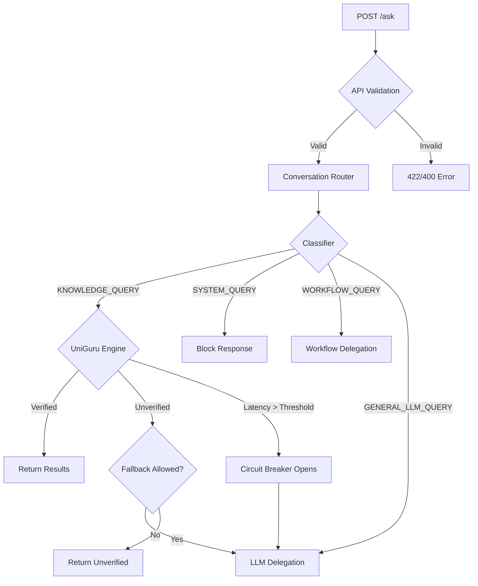

# UniGuru Conversation Router Architecture

## Purpose
The conversation router is a control layer above UniGuru reasoning, governance, ontology, and enforcement. It decides which inbound query path should execute:
- `ROUTE_UNIGURU`
- `ROUTE_LLM`
- `ROUTE_WORKFLOW`
- `ROUTE_SYSTEM`

## Module
- `uniguru/router/conversation_router.py`

## Core Types
- Query classes:
  - `KNOWLEDGE_QUERY`
  - `SYSTEM_QUERY`
  - `WORKFLOW_QUERY`
  - `TOOL_QUERY`
  - `GENERAL_LLM_QUERY`
- Route targets:
  - `ROUTE_UNIGURU`
  - `ROUTE_LLM`
  - `ROUTE_WORKFLOW`
  - `ROUTE_SYSTEM`

## Request Flow

1. `POST /ask` receives request in `uniguru/service/api.py`.
2. API validates auth, caller, and request format.
3. API sends `query + context` to `ConversationRouter.route_query`.
4. Router classifies query type and selects route target.
5. Router dispatches to:
   - UniGuru deterministic engine for knowledge queries.
   - Workflow delegation response path for workflow/tool requests.
   - LLM delegation response path for open conversation.
   - System-block response for unsafe system commands.
6. API returns canonical response payload and logs route metadata.

## Safety and Resilience
- `UNVERIFIED` fallback:
  - If UniGuru response is `UNVERIFIED`, router can delegate to LLM with warning (`UNIGURU_ROUTER_UNVERIFIED_FALLBACK`).
- Latency circuit breaker:
  - If UniGuru latency crosses `UNIGURU_ROUTER_LATENCY_THRESHOLD_MS`, router opens breaker for `UNIGURU_ROUTER_CIRCUIT_OPEN_SECONDS` and temporarily uses LLM fallback.
- Queue protection:
  - API queue admission guard with `UNIGURU_ROUTER_QUEUE_LIMIT` rejects overload with `503`.

## Observability
- Router decision is attached to response:
  - `routing.query_type`
  - `routing.route`
  - `routing.router_latency_ms`
- Metrics added:
  - `uniguru_ask_route_total{route=...}`
  - `uniguru_router_queue_rejected_total`
