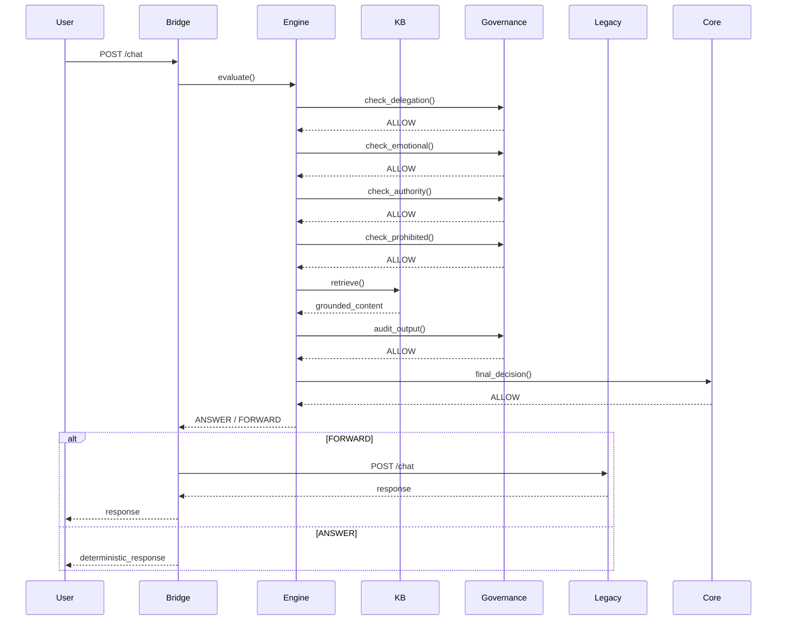

# EXECUTION_CHAIN_DOCUMENT.md

## Purpose
This document explains the deterministic execution chain of UniGuru.  
It traces how a user query travels from API entry to final response.

This document is intended for handover readiness.

---

## System Entry Point

**File**
uniguru/bridge/server.py

The system entry point is the async `chat` function mapped to **POST /chat**.

The endpoint receives a `ChatRequest` containing:
- user message
- session_id
- source

The bridge generates a unique **trace_id** for observability and forwards the request to the reasoning engine.

---

## Step 1 — User Input Enters System

**File**
uniguru/bridge/server.py

The bridge forwards the user message to the reasoning engine via:

RuleEngine.evaluate()

Located in:
uniguru/core/engine.py

This method orchestrates the full rule-based evaluation pipeline.

---

## Step 2 — Governance Pre-Check

### Governance Rule Files

| Rule | File |
|---|---|
| Delegation detection | `uniguru/governance/delegation.py` |
| Emotional / pressure detection | `uniguru/governance/emotional.py` |
| Authority assumption detection | `uniguru/governance/authority.py` |
| Prohibited activity detection | `uniguru/enforcement/safety.py` |

Governance runs as **Tier-0 / Tier-1 safety layer**.

If any rule triggers:
RuleAction.BLOCK
Execution stops immediately.  
The request never reaches retrieval or generation.

---

## Step 3 — Logic Layer Processing

**Primary Engine**
uniguru/core/engine.py

**Ambiguity Rule**
uniguru/governance/ambiguity.py

The system deterministically classifies the query into one action:

| Decision | Trigger |
|---|---|
| REFUSE | Unsafe / Delegation / Authority violations |
| CLARIFY | AmbiguityRule detects missing context |
| RETRIEVE | RetrievalRule detects KB knowledge query |
| RESPOND_DIRECTLY | EmotionalRule or ForwardRule |

This ensures predictable behaviour.

---

## Step 4 — Retrieval Execution

**File**
uniguru/retrieval/retriever.py

**Knowledge Base**
uniguru/Quantum_KB/

### Process
1. `KnowledgeRetriever` scans all `.md` files.
2. Files loaded into deterministic keyword map.
3. Best match selected using rule-based matching.
4. Retrieved content returned as grounded context.

No generative hallucination occurs.

---

## Step 5 — Governance Output Audit

**File**
uniguru/core/governance.py

**Function**
GovernanceEngine.audit_output()

### Checks
- `VERBOTEN_PATTERNS` (e.g. sudo, rm -rf)
- `AUTHORITY_PATTERNS` (false authority claims)

This is the **second safety gate**.

---

## Step 6 — Enforcement Final Decision

**File**
uniguru/core/core.py

**Class**
UniGuruCore

The enforcement layer:
- Verifies governance compliance
- Requests final `PolicyDecision`
- Produces final **ALLOW / BLOCK verdict**

This layer has **final authority**.

---

## Step 7 — Response Returned

**File**
uniguru/bridge/server.py

Bridge returns result based on decision:

| Decision | Action |
|---|---|
| BLOCK | Return rejection message |
| ANSWER | Return deterministic KB response |
| FORWARD | Forward request to legacy backend |

Legacy call:
http://127.0.0.1:8080/chat

---

## End-to-End Pipeline Summary
User → API → Governance → Decision → Retrieval → Output Audit → Enforcement → Response

---

## Execution Flow Summary

---

## Key Deterministic Points

1. **No Randomness** — All decisions are rule-based, not probabilistic.
2. **No External LLM** — The Bridge never calls an LLM directly.
3. **KB Grounding** — Retrieval uses exact filename matching.
4. **Enforcement Authority** — The Core layer has final say.

---

## Handover Readiness

This document provides:
- Step-by-step execution trace
- File locations for every component
- Clear decision boundaries
- Deterministic behaviour guarantees

Ready for handover.

