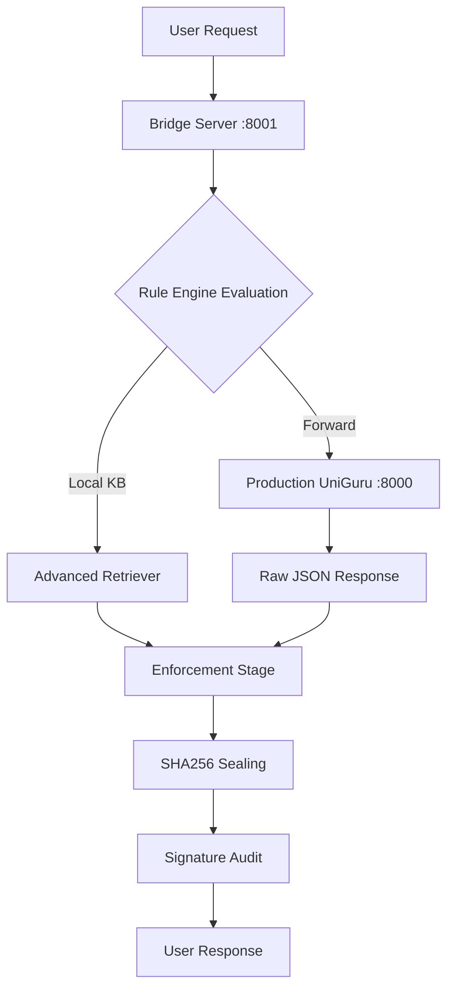

# PRODUCTION INTEGRATION REPORT

**Document ID:** UG-PROD-2026-02-26  
**Status:** CONNECTED  

---

## 1. Connection Update
The Bridge has been connected to the live UniGuru production environment.

**Configuration:**
- **Local Proxy Endpoint:** `http://localhost:8001/chat`
- **Production Backend Endpoint:** `http://localhost:8000/api/v1/chat/new`

## 2. Integration Flow (End-to-End)
Gap 4 required a Bridge → Production → Enforcement flow.

## 3. Forwarding Safeguards
- **Timeout Management:** Forwarding requests are limited to a 10-second timeout.
- **Fail-Over:** If the production backend returns 4xx/5xx, the Bridge automatically engages the `Refusal Rule` to prevent empty or broken responses.
- **Trace Continuity:** The Bridge-generated `trace_id` is logged alongside production backend requests for unified debugging.

---
*Authorized by: Sovereign Architect AI*
