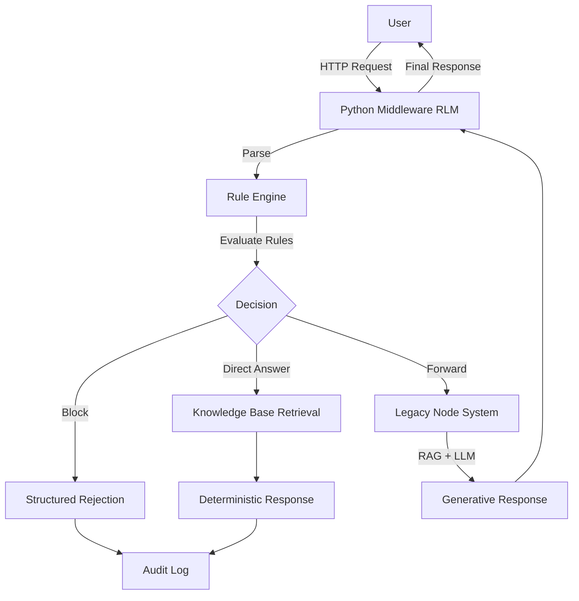

# System Execution Map

## 1. Current System State (Fragmented)

### A. Python Reasoning Core (`uniguru_core`)
**Flow:**
1.  **Input**: String `user_input`.
2.  **Validation**:
    *   `detect_delegation`
    *   `detect_pressure`
    *   `detect_authority_assumption`
    *   `detect_prohibited_activity`
    *   `detect_emotional_load`
    *   `detect_ambiguity`
3.  **Retrieval**: `retrieve_knowledge(query)` -> Keyword Map -> Read File.
4.  **Response**: `direct_response` (Deterministic string).

**Characteristics:**
*   **Deterministic**: Yes (mostly, simple string matching).
*   **State**: Stateless.
*   **Scope**: "Demo-Safe" (Limited KB coverage, simple rules).

### B. Legacy Node/Express System (Assumed)
**Flow (Inferred from RAG pattern):**
1.  **Input**: HTTP POST `/chat`
2.  **Authentication**: Middleware.
3.  **Retrieval**: Vector DB (Embeddings) / Semantic Search.
4.  **Generation**: LLM Call (OpenAI/Anthropic etc).
5.  **Response**: Generated Text.

**Characteristics:**
*   **Deterministic**: No (Generative).
*   **State**: Session-based (Conversation history).
*   **Scope**: Full Product Capability.

---

## 2. Unified Target Architecture (RLM v1)

**Flow:**
1.  **User Request** executes against **Middleware Bridge** (Python).
2.  **Rule Engine Evaluation** (RLM):
    *   Priority 1: `AuthorityRule` (System integrity).
    *   Priority 2: `UnsafeRule` (Harm/Prohibited).
    *   Priority 3: `AmibiguityRule` (Clarification).
    *   Priority 4: `EmotionalRule` (Empathy/Redirect).
    *   Priority 5: `DelegationRule` (Refusal/Guidance).
3.  **Decision Gate**:
    *   **BLOCK**: Return structured decision (e.g., "Violation").
    *   **ANSWER (Deterministic)**: Return KB content (if query is purely factual/informational and covers KB).
    *   **FORWARD**: Pass to Legacy Node `/chat`.
4.  **Legacy Node Execution** (If Forwarded):
    *   Execute RAG + LLM.
    *   Return Response to Middleware.
5.  **Audit/Log**: Deterministic trace of the unified path.
6.  **Final Response**: Returned to User.

## 3. Execution Data Flow

